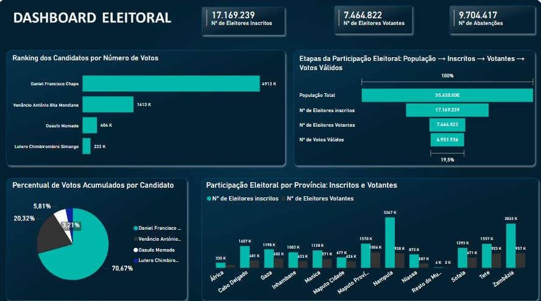

# 🗳️ Power BI – Eleições 2024

## 📊 Descrição do Projecto
Este projecto apresenta um **dashboard interactivo** desenvolvido no **Microsoft Power BI** para análise dos resultados das **Eleições presidenciais de 2024 em Moçambique**.  
O objectivo é facilitar a visualização e interpretação dos dados eleitorais, destacando tendências, percentagens de votos, taxas de participação e resultados por candidato e província.

---

## 🧠 Objectivos
- Analisar os resultados das eleições presidenciais de 2024 de forma visual e intuitiva.  
- Fornecer indicadores de desempenho e participação eleitoral.  
- Permitir comparações entre diferentes províncias e candidatos.  
- Demonstrar competências em **Power BI**, **Power Query**, **Excel**, **DAX** e **Análise de Dados**.

---

## 🧰 Ferramentas Utilizadas
- **Power BI Desktop** – Criação do dashboard e visualizações.  
- **Power Query** – Preparação e limpeza dos dados.
- **DAX** – para cálculos essenciais. 
- **Microsoft Excel** – Construção da Base de Dados. 
- **GitHub** – Publicação do projecto.

---

## 🖼️ Visualização do Dashboard

## 🔍 Principais Indicadores
- Total de eleitores registados e participantes  
- Percentagem de abstenção  
- Resultados por candidato e por província.  

---

## 📈 Resultados Esperados
O dashboard oferece uma visão clara e dinâmica dos resultados eleitorais, permitindo:
- Tomada de decisões informadas.  
- Análises comparativas por região.  
- Divulgação transparente dos resultados ao público.

---

## 👤 Autor
**Gustavo Guambe**  
📧 [gustavoguamb@gmail.com]  
 
